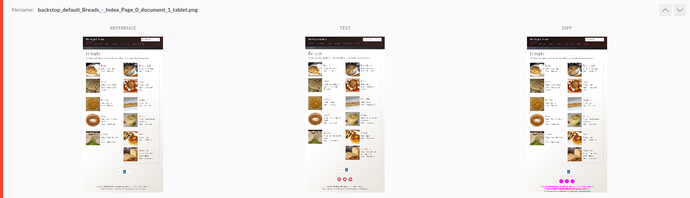
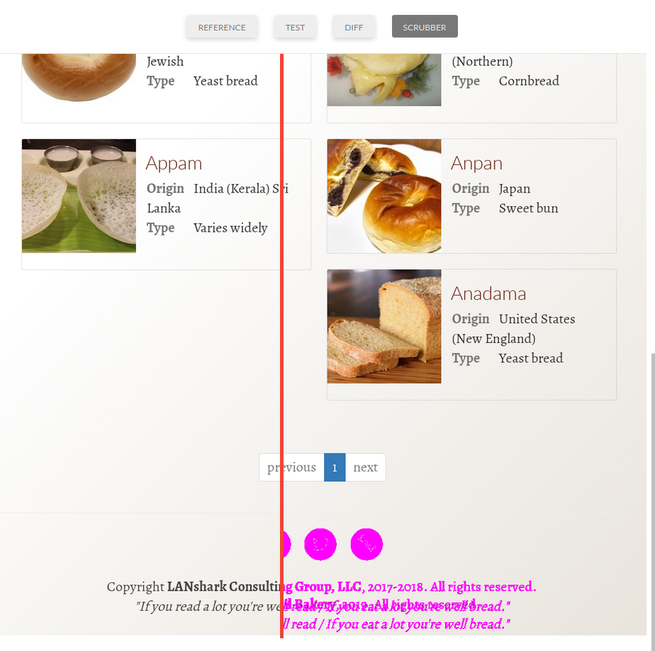

Backstop JS Demo
====================

This is a simple demonstration for development using Backstop JS using a (hopefully) familiar project of Wagtail Bakery.  The forked base Bakery project can be found [here](https://github.com/wagtail/bakerydemo) which includes setup using Vagrant and more information on general use. 

#### Dependencies
* [Docker](https://docs.docker.com/engine/installation/)
* [Docker Compose](https://docs.docker.com/compose/install/)

## Installation
Run the following commands:

```
git clone https://github.com/William-Blackie/bakerydemo-backstop-js-poc.git
cd bakerydemo-backstop-js-poc
docker-compose up --build -d
docker-compose run app /venv/bin/python manage.py load_initial_data
docker-compose up
```

The demo site will now be accessible at [http://localhost:8000/](http://localhost:8000/) and the Wagtail admin
interface at [http://localhost:8000/admin/](http://localhost:8000/admin/).


**Important:** This `docker-compose.yml` is configured for local testing only, and is _not_ intended for production use.

## Getting started
```
npm install 
npm run reference # Generate local reference 
npm run compare # Compare against "Production" version of site.
```

After running compare you will be presented with the backstop JS report for your different screen resolutions, in our case mobile, tablet and desktop with comparisons for the local and the "production" server.

Luckily the hosted version we are comparing against is slightly older than this forked demo at the time of writing so when comparing our local to the remote in backstop.js we have some differences without need for changes.

This output bellow is a failed test showing that changes have been made to the footer of the site that is on our local version and not our production version.



A nice tool of backstop.js is the scrubber feature when inspecting the diff of the two versions making it easier to compare these changes side by side.



### **Important** In this implementation I am using a public version Wagtail bakery running [here](http://bakerydemo.lanshark.com/) provided by LANshark Consulting Group, LLC. Please consider hosting your own site if you wish to test more complicated setup. I have no affiliation to LANshark so to prevent spamming and increasing their costs, host your own.


### Ownership of demo content

As stated above; this is forked from Wagtail bakery [here](https://github.com/wagtail/bakerydemo) and inherits all of the same restrictions and copyright.

All content in the demo is public domain. Textual content in this project is either sourced from Wikipedia or is lorem ipsum. All images are from either Wikimedia Commons or other copyright-free sources.
